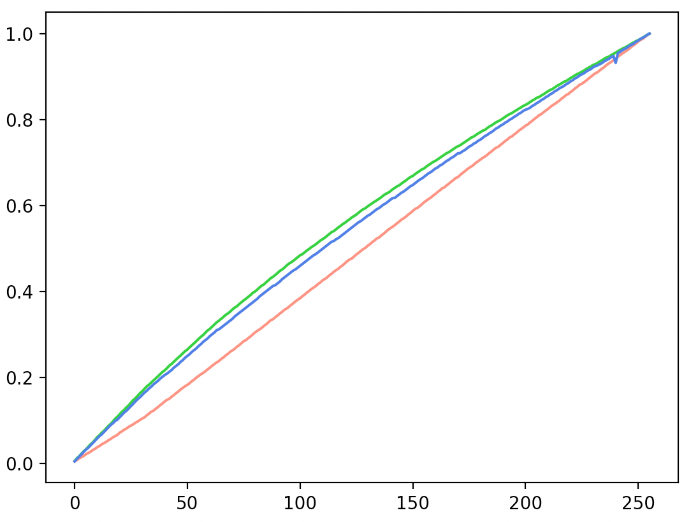
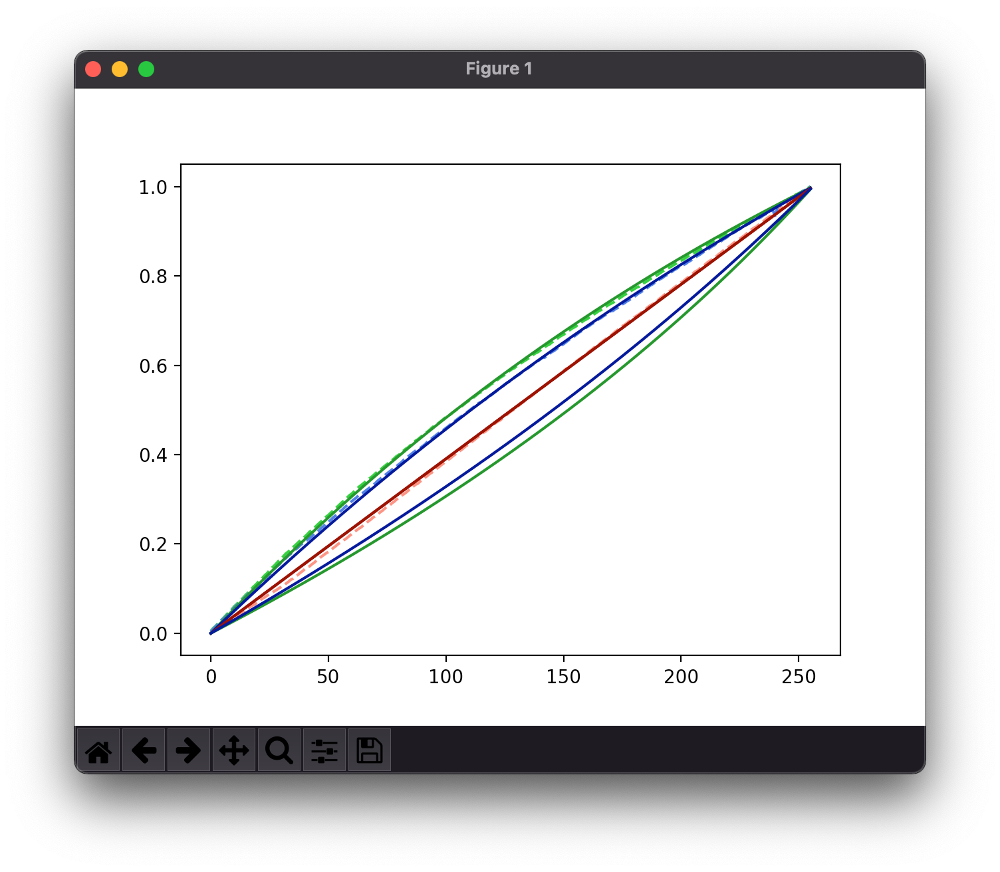
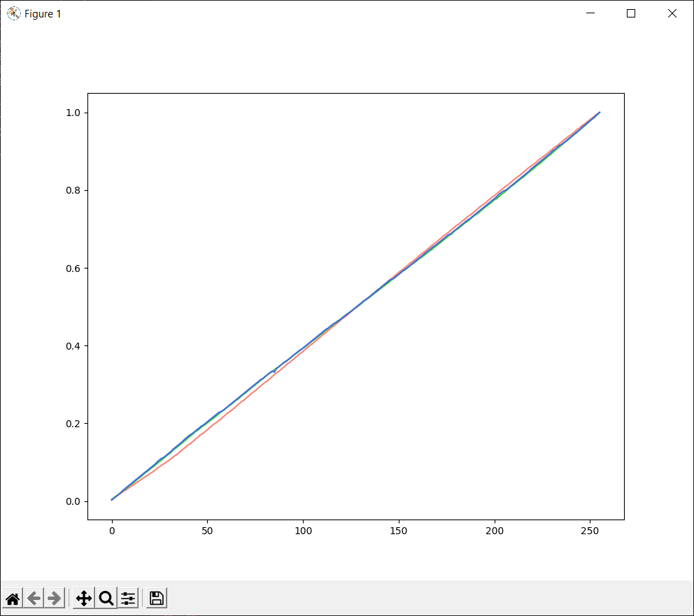

# hd108-calibration

The batch of HD108-5050 LEDs I have does not have a linear response on green and blue. This is fairly visible when fading to black as they shift towards green and blue. With a RaspberryPI and a TSL2591 board we can measure the response curve and determine an approximate correction. 

The measured original response curves:

With some manual curve fitting we can figure out a couple of exponential function constants which map somewhat OK:

Measured graph with correction applied:

